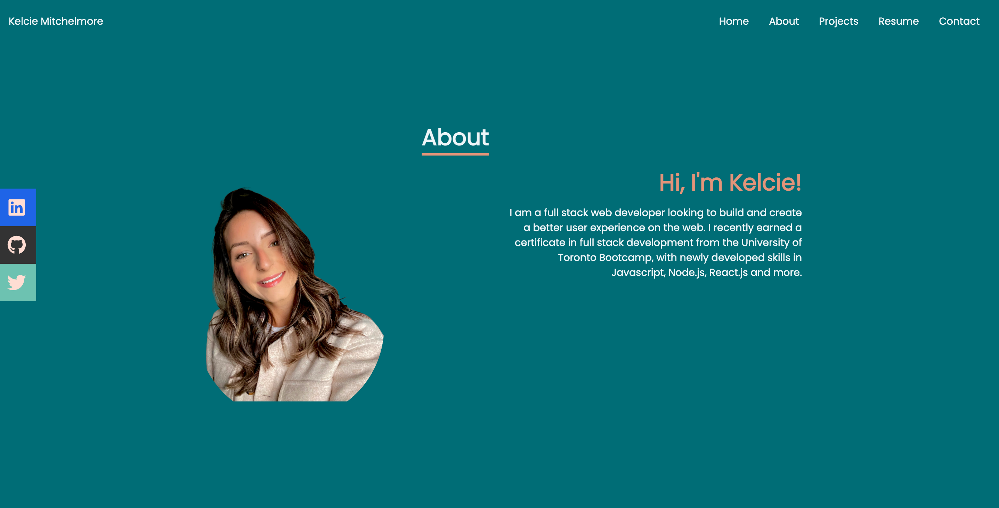

# React Portfolio 

Module 20: React Portfolio Challenge

## Description

This portfolio was created using React.js, Tailwind.css and several other react packages. In my portfolio, you will find a little bit about me, my recent projects I have worked on and a way to connect with me!

## Table-of-Contents 
[Description](#description) -  
[Sneak Peak](#sneak-peak) - 
[Deployment](#deployment) - 
[Questions](#questions)

## Sneak Peak

The following snapspot is a look into what the about page looks like for the portfolio. 

## Deployment

This application is deployed with Github Pages. 

https://kelcmitch97.github.io/React-Portfolio/

To see the Github page for this application, click [here](https://github.com/kelcmitch97/React-Portfolio/tree/main/portfolio)

## Questions

Please contact me using the following links: 

[GitHub](https://github.com/kelcmitch97)

[Email:](kelciemitchelmore@gmail.com) kelciemitchelmore@gmail.com

- - -
© 2021 Trilogy Education Services, LLC, a 2U, Inc. brand. Confidential and Proprietary. All Rights Reserved.

